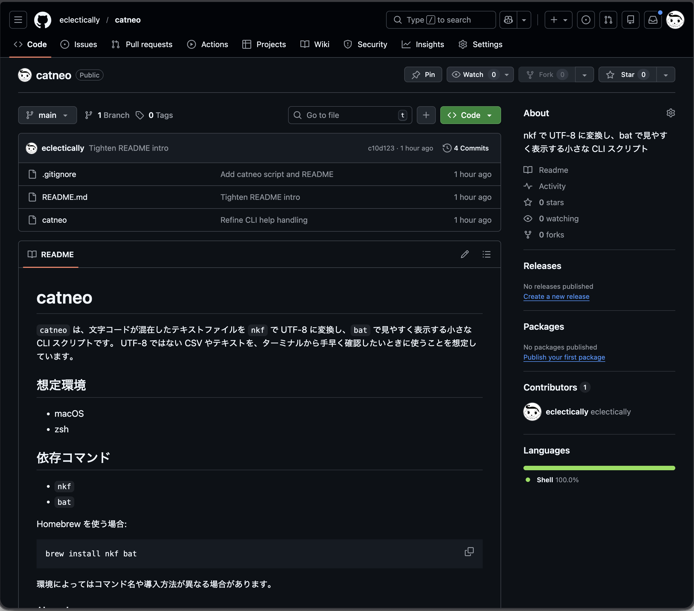

子どものころ、学校から帰って暇になると、絵を描いたり、MIDIで曲を作ったり、フェルトでぬいぐるみを作ったり、自分で漢字を考えたりしていました。

とくに役に立つものを作りたいとい気持ちはなく、単純に**自分だけの妙な発明を作って見せたかった**のだと思います。

でも大人になると、その感覚はだいぶ遠のきました。  
何かを外に出す前に、「管理はどうする」「説明は要るのか」「こんな小さいものに意味あるのか」みたいなことを先に考えるようになる。そうすると、作る面白さより、公開する面倒さの方が前に出てきます。

最近は小さいスクリプトやPythonのコードを書いては個人的に使っていました。
そして今回はじめて、60行くらいの小さなスクリプトを、ChatGPT と Codex を補助輪にして GitHub に公開したので、そのことを記事にしてみます。  
べつに大作ができたわけではありません。公開にまつわる面倒ごとがだいぶ薄くなって、久しぶりに「作ったから見せたい」の方が勝った、という感じです。

## 何を公開したのか

公開したのは、`catneo` という小さな CLI スクリプトです。
標準のcatコマンドを、文字化けさせずに使う、head と tail の機能も入れよう。それだけ。

正直に言うと、このツール自体に強い需要があるとはあまり思っていません。  
便利ではあるけれど、かなり自分用に近い。  
なので最初は、「これを GitHub に出して何になるんだろう」と思っていました。

しかも、普段は `~/bin/catneo` として使っていて、`~/bin` 自体を Git 管理しているわけでもありません。  
だから、

- そもそもどういう単位で Git 管理するのか
- こんな小物を公開していいのか
- README ってどこまで書けばいいのか

このへんが、なんとなく全部めんどうでした。

## コードを書くことより、公開の段取りの方が重かった

今回あらためて分かったのですが、僕が引っかかっていたのはコードを書くことそのものではありませんでした。

困っていたのはむしろ、

- `~/bin` にあるスクリプトをどう整理するか
- repo をどこに作るか
- ローカル運用を壊さずに GitHub 公開へ持っていけるのか
- 小さいものを出すのに、どこまで整えれば十分なのか

こういう、**公開の周辺にある段取り**です。

Git や GitHub が本質的に難しいというより、  
「どこまでやれば “公開してよい形” なのか」が曖昧だった、という方が近い気がします。

## ChatGPT と Codex がよかったのは、面倒さを減らしてくれたこと

今回はまず ChatGPT と相談して方針を決めて、そのあと Codex にかなり具体的な指示を渡して進めました。
Codexに投げるmdはChatGPTに作ってもらってます。
やったこと自体はそんなに大したことではありません。

- 公開用の repo を別で作る
- `catneo` の実体を repo 側に置く
- `~/bin/catneo` は symlink にする
- `README.md` を作る
- Git 初期化して push する

ただ、これを最初から全部ひとりで考えると、やっぱり微妙に腰が重い。

今回よかったのは、AI が全部やってくれたことではなくて、**面倒な部分の見通しが立ったこと**でした。

- 最小構成でよいと分かった
- 実体と呼び出しの置き場を分ければよいと分かった
- Codex に渡す指示文を作れた
- README の最低ラインが見えた

このへんが見えたことで、公開に対する感覚がかなり変わりました。

## 面白さと面倒さの天秤が、ひっくり返った

たぶん今回いちばん大きかったのはこれです。

もともと、作ったものを外に出すこと自体には、前からちょっとした面白さを感じていました。  
でもその一方で、

- Git 管理
- README
- repo の構成
- 公開してよいかどうかの迷い

みたいな面倒さがあって、ずっとそっちが勝っていた。

今回は便利なツールのおかげで、その面倒さがかなり減りました。  
その結果、**「公開することの面白さ」と「公開することの面倒さ」の天秤が、ようやく面白さの方に傾いた**という感じがします。

## スクリーンショット

よくインターネットで見る、あの画面だ！

## 子どものころの感覚が少し戻ってきた

今回のことでいちばん面白かったのは、GitHub 公開の事実そのものより、感覚の方かもしれません。

子どものころは、絵でも、MIDIでも、フェルトぬいぐるみでも、自作の漢字でも、とにかく思いついたら形にしていたし、できたものを見せるのも好きでした。  
そこでは、費用対効果なんてあまり考えていなかったと思います。

でも大人になると、何かを発表する前に、正当性を気にするようになる。

- これは役に立つのか
- 出す価値はあるのか
- 面倒に見合うのか

そういう審査が先に入る。

今回 AI が変えてくれたのは、創作の中身ではなく、その周辺の面倒ごとです。  
だからこそ、久しぶりに、**自分だけの妙な発明をひとつ外へ出した**という感じがしました。

僕にとって小さなスクリプトの公開は、実用品の配布というより、そっちの意味合いの方が強かったのだと思います。

## 最初の1本に必要だったもの

今回やってみて思ったのは、最初の GitHub 公開に必要なのは、大作でも完璧な設計でもないということです。

必要だったのは、たぶんこれくらいでした。

- これくらいで出していい、と思える最小単位
- 公開の面倒さを減らしてくれる補助輪
- 自分の過剰な自己検閲を少し弱めるきっかけ

その意味で、ChatGPT や Codex は、コードを全部書いてくれる魔法というより、**公開までの摩擦を減らしてくれる道具**として効いた気がします。

## まとめ

`catneo` は、世の中の多くの人が待っていたツールではないと思います。  
でも、僕にとっては最初の1本として十分意味がありました。

- `~/bin` に置いていた小さなスクリプトでも GitHub に出せる
- 公開のために最初から大げさな構成は要らない
- AI を補助輪にすると、面倒さがかなり減る
- そして「作ったから見せたい」という感覚が少し戻ってくる

もし手元に、ローカルでしか使っていない小さなスクリプトがあるなら、それも案外、最初の1本になるのかもしれません。

そしてそれは単なる技術公開ではなく、**自分だけの妙な発明を、もう一度外に出してみること**でもあるのだと思います。
